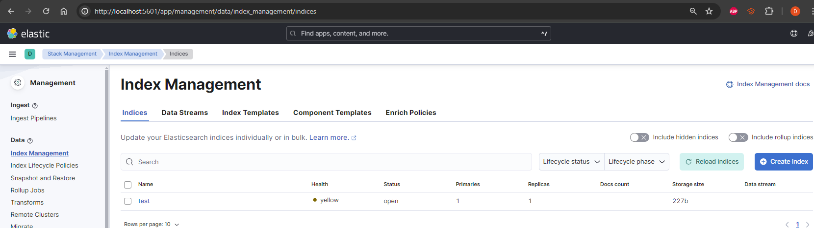

# Task Final Semester - Ankenbrand - BAP - 5BHIF
Task:
monitoring, performance testing & tuning - task: build mini setup with single application with monitoring (prometheus etc.) and logging (elastic. )

1. Set Up simple Java-API
2. Set Up Prometheus for Monetoring
3. Set up gatling for Tests
4. Set Up grafana for visualision
5. Tunning
6. Logging

#### Used Links:
API
- http://localhost:8080/getID/1
- http://localhost:8080/counterIncrease
- http://localhost:8080/actuator/prometheus

Prometheus
- http://localhost:9090/graph  

Grafana
- http://localhost:3000/    

Elastic - Kibana:
http://localhost:5601
http://localhost:5601/?code=<token>

## 1. API
I will use an old java api from an internship - todo_test api

The API is an Todo list with the endpoints:
- /getAll
- /getId/{Id}
- /getTitle/{title}
- /Del/{Id}
- /patch/{Id}
- /counterIncrease

### dockerize the api:
```bash
Dockerfile:

FROM openjdk:18-alpine

WORKDIR /app

COPY target/todo_test-0.0.1-SNAPSHOT.jar app.jar

EXPOSE 8080

CMD ["java", "-jar", "app.jar"]

```

## 2. Prometheus
first of all i set up Prometheus in the app
```xml

<dependency>
    <groupId>org.springframework.boot</groupId>
    <artifactId>spring-boot-starter-actuator</artifactId>
</dependency>

<dependency>
    <groupId>io.micrometer</groupId>
    <artifactId>micrometer-registry-prometheus</artifactId>
    <scope>runtime</scope>
</dependency>

```
then i  dockerize the whole thing over docker-compose:
```bash

version: "3.9"

services:
  prometheus:
    image: prom/prometheus
    ports:
      - "9090:9090"
    volumes:
      - ./prometheus.yml:/etc/prometheus/prometheus.yml
    
    networks:
      - prometheus-net

  database:
    image: postgres:15-alpine
    ports:
      - "5432:5432"
    environment:
      POSTGRES_USER: postgres
      POSTGRES_PASSWORD: postgres
      POSTGRES_DB: BAPTest
    networks:
      prometheus-net:
        aliases:
          - database


  java-api:
    build: .
    #image: todo_test 
    ports:
      - "8080:8080"
    networks:
      prometheus-net:
        aliases:
          - api
    depends_on:
      -  database
    environment:
      SPRING_DATASOURCE_URL: jdbc:postgresql://database:5432/BAPTest
      SPRING_DATASOURCE_USERNAME: postgres
      SPRING_DATASOURCE_PASSWORD: postgres


```


networks:
  prometheus-net:


There were a lot of bugs an problmes to solve, but now it works just fine!
I had to change the prometheus.yml file because the metrixes got exposed to /actuator/prometheus and prometheus try /mertrix

    global:
      scrape_interval:     15s
    
    scrape_configs:
      - job_name: 'spring-boot-app'
        metrics_path: '/actuator/prometheus'
        static_configs:
          - targets: ['api:8080']

### Target

### Graph

http_server_requests_seconds_count{exception="None", instance="api:8080", job="spring-boot-app", method="GET", outcome="SUCCESS", status="200", uri="/counterIncrease"}


## 3. Gatling

Pom.xml


```xml
	<build>
		<plugins>
			<plugin>
				<groupId>org.springframework.boot</groupId>
				<artifactId>spring-boot-maven-plugin</artifactId>
			</plugin>
			<plugin>
				<groupId>io.gatling</groupId>
				<artifactId>gatling-maven-plugin</artifactId>
				<version>3.1.2</version>
				<configuration>
					<simulationClass>YourGatlingSimulation</simulationClass>
				</configuration>
			</plugin>
		</plugins>
	</build>

```

## The Simulation
```java

class YourGatlingSimulation extends Simulation {

  val httpProtocol = http.baseUrl("http://localhost:8080")

  val scn = scenario("YourScenario")
    .repeat(10) {
      exec(http("GetID")
        .get("/getID/1"))
    }
    .exec(http("GetAll")
            .get("/getAll"))
    .exec(http("Startpage")
                .get("/"))
    .exec(http("getTitel")
                .get("/getTitel/Test_titel"))


  private val modelJsonString: String =
    s"""
       |{
       |  "Id": 10,
       |  "createdate": "2022-09-23 00:00:00.0",
       |  "desci": "test_des",
       |  "done": false,
       |  "endDate": "2022-09-25 00:00:00.0",
       |  "lastupdate": "2022-09-23 00:00:00.0",
       |  "priority": 1,
       |  "startDate": "2022-09-23 00:00:00.0",
       |  "title": "Test_titel"
       |}
       |""".stripMargin


  private val scn2 = scenario("POST")
    .exec(http("PostModel")
      .post("/todoPost")
      .body(StringBody(modelJsonString)).asJson)
    .pause(5)
    .exec(http("GetModel_after_Post")
      .get("/getID/10"))

  setUp(
    scn.inject(atOnceUsers(1)).protocols(httpProtocol),
    scn2.inject(atOnceUsers(1)).protocols(httpProtocol)
  )}
```


```bash
Simulation YourGatlingSimulation started...

================================================================================
2024-01-20 16:27:49                                           5s elapsed
---- Requests ------------------------------------------------------------------
> Global                                                   (OK=0      KO=0     )


---- YourScenario --------------------------------------------------------------
[--------------------------------------------------------------------------]  0%
          waiting: 0      / active: 1      / done: 0
================================================================================


================================================================================
2024-01-20 16:27:53                                          10s elapsed
---- Requests ------------------------------------------------------------------
> Global                                                   (OK=0      KO=0     )


---- YourScenario --------------------------------------------------------------
[--------------------------------------------------------------------------]  0%
          waiting: 0      / active: 1      / done: 0
================================================================================


================================================================================
2024-01-20 16:27:59                                          15s elapsed
---- Requests ------------------------------------------------------------------
> Global                                                   (OK=0      KO=0     )


---- YourScenario --------------------------------------------------------------
[--------------------------------------------------------------------------]  0%
          waiting: 0      / active: 1      / done: 0
================================================================================


================================================================================
2024-01-20 16:28:02                                          18s elapsed
---- Requests ------------------------------------------------------------------
> Global                                                   (OK=0      KO=1     )
> GetID                                                    (OK=0      KO=1     )
---- Errors --------------------------------------------------------------------
> status.find.in(200,201,202,203,204,205,206,207,208,209,304), f      1 (100,0%)
ound 500

---- YourScenario --------------------------------------------------------------
[##########################################################################]100%
          waiting: 0      / active: 0      / done: 1
================================================================================

Simulation YourGatlingSimulation completed in 15 seconds
Parsing log file(s)...
Parsing log file(s) done
Generating reports...

================================================================================
---- Global Information --------------------------------------------------------
> request count                                          1 (OK=0      KO=1     )
> min response time                                  15628 (OK=-      KO=15628 )
> max response time                                  15628 (OK=-      KO=15628 )
> mean response time                                 15628 (OK=-      KO=15628 )
> std deviation                                          0 (OK=-      KO=0     )
> response time 50th percentile                      15628 (OK=-      KO=15628 )
> response time 75th percentile                      15628 (OK=-      KO=15628 )
> response time 95th percentile                      15628 (OK=-      KO=15628 )
> response time 99th percentile                      15628 (OK=-      KO=15628 )
> mean requests/sec                                  0.062 (OK=-      KO=0.062 )
---- Response Time Distribution ------------------------------------------------
> t < 800 ms                                             0 (  0%)
> 800 ms < t < 1200 ms                                   0 (  0%)
> t > 1200 ms                                            0 (  0%)
> failed                                                 1 (100%)
---- Errors --------------------------------------------------------------------
> status.find.in(200,201,202,203,204,205,206,207,208,209,304), f      1 (100,0%)
ound 500
================================================================================

Reports generated in 3s.
Please open the following file: I:\Dokumente 4TB\HTL\5 Klasse\BAP\sj2324-5xhif-bap-performance-testing-David-vie21\todo_test\target\gatling\yourgatlingsimulation-20240120152743908\index.html
[INFO] ------------------------------------------------------------------------
[INFO] BUILD SUCCESS
[INFO] ------------------------------------------------------------------------
[INFO] Total time:  49.574 s
[INFO] Finished at: 2024-01-20T16:28:06+01:00
[INFO] ------------------------------------------------------------------------
```


### Now in Docker

I added to the compose file 

```bash
COPY --from=denvazh/gatling:3.1.2 /opt/gatling/lib /gatling


/app # mvn gatling:test -Dgatling.simulationClass=YourGatlingSimulation
/bin/sh: mvn: not found
```

### maven and gatling install in dockerfile

```bash
RUN apk add --no-cache maven
COPY --from=denvazh/gatling:3.1.2 /opt/gatling/lib /gatling
```

### failed
```bash
2024-04-12 19:06:47 [INFO] BUILD FAILURE
2024-04-12 19:06:47 [ERROR] The goal you specified requires a project to execute but there is no POM in this directory (/app). Please verify you invoked Maven from the correct directory. -> [Help 1]
```

### also pom.xml mitkopieren

```bash
COPY target/todo_test-0.0.1-SNAPSHOT.jar pom.xml /app/

```
### api and gatling spearated execute

```bash
CMD ["java", "-cp", "app.jar", "com.example.todo_test"]
CMD ["java", "-jar", "app.jar"]
ENTRYPOINT ["mvn", "gatling:test", "-Dgatling.simulationClass=YourGatlingSimulation"]
```
### failed
```bash
BUILD FAILURE
2024-04-12 19:21:12 [INFO] ------------------------------------------------------------------------
2024-04-12 19:21:12 [INFO] Total time:  6.623 s
2024-04-12 19:21:12 [INFO] Finished at: 2024-04-12T17:21:12Z
2024-04-12 19:21:12 [INFO] ------------------------------------------------------------------------
2024-04-12 19:21:12 [ERROR] Unknown lifecycle phase "java". You must specify a valid lifecycle phase or a goal in the format <plugin-prefix>:<goal> or <plugin-group-id>:<plugin-artifact-id>[:<plugin-version>]:<goal>. Available lifecycle phases are: validate, initialize, generate-sources, process-sources, generate-resources, process-resources, compile, process-classes, generate-test-sources, process-test-sources, generate-test-resources, process-test-resources, test-compile, process-test-classes, test, prepare-package, package, pre-integration-test, integration-test, post-integration-test, verify, install, deploy, pre-clean, clean, post-clean, pre-site, site, post-site, site-deploy. -> [Help 1]
2024-04-12 19:21:12 [ERROR]
```


### words
after multibles try and it worked, now i had to copy the simulation file too

```bash
COPY src/test/scala/YourGatlingSimulation.scala /app/src/test/scala/YourGatlingSimulation.scala 
```

```bash

Simulation YourGatlingSimulation started...

================================================================================
2024-04-12 17:56:08                                           5s elapsed
---- Requests ------------------------------------------------------------------
> Global                                                   (OK=14     KO=0     )
> PostModel                                                (OK=1      KO=0     )
> GetID                                                    (OK=10     KO=0     )
> GetAll                                                   (OK=1      KO=0     )
> Startpage                                                (OK=1      KO=0     )
> getTitel                                                 (OK=1      KO=0     )

---- POST ----------------------------------------------------------------------
[--------------------------------------------------------------------------]  0%
          waiting: 0      / active: 1      / done: 0     
---- YourScenario --------------------------------------------------------------
[##########################################################################]100%
          waiting: 0      / active: 0      / done: 1     
================================================================================

17:56:11.091 [gatling-http-1-3][WARN ][StatsProcessor.scala:114] i.g.h.e.r.DefaultStatsProcessor - Request 'GetModel_after_Post' failed for user 2: status.find.in(200,201,202,203,204,205,206,207,208,209,304), found 404

================================================================================
2024-04-12 17:56:11                                           7s elapsed
---- Requests ------------------------------------------------------------------
> Global                                                   (OK=14     KO=1     )
> PostModel                                                (OK=1      KO=0     )
> GetID                                                    (OK=10     KO=0     )
> GetAll                                                   (OK=1      KO=0     )
> Startpage                                                (OK=1      KO=0     )
> getTitel                                                 (OK=1      KO=0     )
> GetModel_after_Post                                      (OK=0      KO=1     )
---- Errors --------------------------------------------------------------------
> status.find.in(200,201,202,203,204,205,206,207,208,209,304), f      1 (100.0%)
ound 404

---- POST ----------------------------------------------------------------------
[##########################################################################]100%
          waiting: 0      / active: 0      / done: 1     
---- YourScenario --------------------------------------------------------------
[##########################################################################]100%
          waiting: 0      / active: 0      / done: 1     
================================================================================

Simulation YourGatlingSimulation completed in 5 seconds
Parsing log file(s)...
Parsing log file(s) done
Generating reports...

================================================================================
---- Global Information --------------------------------------------------------
> request count                                         15 (OK=14     KO=1     )
> min response time                                      8 (OK=8      KO=10    )
> max response time                                    623 (OK=623    KO=10    )
> mean response time                                   102 (OK=108    KO=10    )
> std deviation                                        198 (OK=203    KO=0     )
> response time 50th percentile                         16 (OK=16     KO=10    )
> response time 75th percentile                         31 (OK=36     KO=10    )
> response time 95th percentile                        591 (OK=594    KO=10    )
> response time 99th percentile                        617 (OK=617    KO=10    )
> mean requests/sec                                    2.5 (OK=2.333  KO=0.167 )
---- Response Time Distribution ------------------------------------------------
> t < 800 ms                                            14 ( 93%)
> 800 ms < t < 1200 ms                                   0 (  0%)
> t > 1200 ms                                            0 (  0%)
> failed                                                 1 (  7%)
---- Errors --------------------------------------------------------------------
> status.find.in(200,201,202,203,204,205,206,207,208,209,304), f      1 (100.0%)
ound 404
================================================================================

Reports generated in 0s.
Please open the following file: /app/target/gatling/yourgatlingsimulation-20240412175603829/index.html
[INFO] ------------------------------------------------------------------------
[INFO] BUILD SUCCESS
[INFO] ------------------------------------------------------------------------
[INFO] Total time:  02:08 min
[INFO] Finished at: 2024-04-12T17:56:11Z
[INFO] ------------------------------------------------------------------------
```

## 3.2 Gatling Counter + Prometeues

I added a counter entpoint to it for Promethues

```java

 static final MeterRegistry meterRegistry = new SimpleMeterRegistry();
    static final Counter requests = Counter.builder("counterTest")
            .tags("type", "increment").register(meterRegistry);
    @GetMapping("/counterIncrease")
    public double increaseCounter() {
        requests.increment();
        //++counter;
        //System.out.println(counter);
        System.out.println(requests);
        return requests.count();
    }

@Configuration
public class MeterRegistryConfig {

    @Bean
    public MeterRegistry meterRegistry() {
        return new SimpleMeterRegistry();
    }
}
```

and a new Simulation

```java
class YourGatlingSimulation_Counter extends Simulation {

  val httpProtocol = http.baseUrl("http://localhost:8080")

    val scn = scenario("Scenario_Counter")
      .exec(http("counterIncrease")
        .get("/increaseCounter"))
      .repeat(10) {
        exec(http("increaseCounter")
          .get("/counterIncrease"))
      }

  setUp(
    scn.inject(atOnceUsers(1)).protocols(httpProtocol),
  )
}
```


### Run Gatling Sim for Counter Test

## 4. Grafana

Docker Compose
```bash

grafana:
      image: grafana/grafana:latest
      depends_on:
        - prometheus
      volumes:
        - ./grafana/data:/var/lib/grafana
      ports:
        - "3000:3000"
      networks: 
        - prometheus-net
```


### 4.2 Counter Test


```bash
Simulation YourGatlingSimulation_Counter started...
12:40:38.258 [gatling-http-1-2][WARN ][StatsProcessor.scala:114] i.g.h.e.r.DefaultStatsProcessor - Request 'counterIncrease' failed for user 1: status.find.in(200,201,202,203,204,205,206,207,208,209,304), found 404

================================================================================
2024-04-13 12:40:38                                           1s elapsed
---- Requests ------------------------------------------------------------------
> Global                                                   (OK=10     KO=1     )
> counterIncrease                                          (OK=0      KO=1     )
> increaseCounter                                          (OK=10     KO=0     )
---- Errors --------------------------------------------------------------------
> status.find.in(200,201,202,203,204,205,206,207,208,209,304), f      1 (100.0%)
ound 404

---- Scenario_Counter ----------------------------------------------------------
[##########################################################################]100%
          waiting: 0      / active: 0      / done: 1     
================================================================================

Simulation YourGatlingSimulation_Counter completed in 0 seconds
Parsing log file(s)...
Parsing log file(s) done
Generating reports...

================================================================================
---- Global Information --------------------------------------------------------
> request count                                         11 (OK=10     KO=1     )
> min response time                                      5 (OK=5      KO=121   )
> max response time                                    121 (OK=29     KO=121   )
> mean response time                                    20 (OK=10     KO=121   )
> std deviation                                         32 (OK=7      KO=0     )
> response time 50th percentile                          9 (OK=8      KO=121   )
> response time 75th percentile                         13 (OK=11     KO=121   )
> response time 95th percentile                         75 (OK=23     KO=121   )
> response time 99th percentile                        112 (OK=28     KO=121   )
> mean requests/sec                                     11 (OK=10     KO=1     )
---- Response Time Distribution ------------------------------------------------
> t < 800 ms                                            10 ( 91%)
> 800 ms < t < 1200 ms                                   0 (  0%)
> t > 1200 ms                                            0 (  0%)
> failed                                                 1 (  9%)
---- Errors --------------------------------------------------------------------
> status.find.in(200,201,202,203,204,205,206,207,208,209,304), f      1 (100.0%)
ound 404
================================================================================

Reports generated in 0s.
Please open the following file: /app/target/gatling/yourgatlingsimulation-counter-20240413124036695/index.html
[INFO] ------------------------------------------------------------------------
[INFO] BUILD SUCCESS
[INFO] ------------------------------------------------------------------------
[INFO] Total time:  01:16 min
[INFO] Finished at: 2024-04-13T12:40:39Z
[INFO] ------------------------------------------------------------------------
```


# 5. Tunning

docker stats


CONTAINER ID   NAME                     CPU %     MEM USAGE / LIMIT     MEM %     NET I/O           BLOCK I/O   PIDS
75dec59ec0ff   todo_test-java-api-1     0.24%     319.6MiB / 12.45GiB   2.51%     143MB / 4.76MB    0B / 0B     44
4e87a5e636a6   todo_test-grafana-1      0.19%     67.58MiB / 12.45GiB   0.53%     458kB / 504kB     0B / 0B     21
367f3d328bac   todo_test-prometheus-1   0.00%     36.61MiB / 12.45GiB   0.29%     3.39MB / 161kB    0B / 0B     12
c654b435b02e   todo_test-database-1     0.03%     47.58MiB / 12.45GiB   0.37%     35.4kB / 33.6kB   0B / 0B     16


I combiend two steps of the docker file to one 
```bash

COPY target/todo_test-0.0.1-SNAPSHOT.jar pom.xml /app/
COPY src/test/scala/YourGatlingSimulation.scala /app/src/test/scala/YourGatlingSimulation.scala 

=>

COPY target/todo_test-0.0.1-SNAPSHOT.jar pom.xml src/test/scala/YourGatlingSimulation.scala /app/

```

but it donst worked because i needed different locations for the files


I gave the API and the database 2 cps each
```bash
  database:
    image: postgres:15-alpine
    ports:
      - "5432:5432"
    cpus: 2
    environment:
      POSTGRES_USER: postgres
      POSTGRES_PASSWORD: postgres
      POSTGRES_DB: BAPTest
    networks:
      prometheus-net:
        aliases:
          - database


  java-api:
    build: .
    #image: todo_test 
    ports:
      - "8080:8080"
    networks:
      prometheus-net:
        aliases:
          - api
    depends_on:
      -  database
    cpus: 2
    environment:
      SPRING_DATASOURCE_URL: jdbc:postgresql://database:5432/BAPTest
      SPRING_DATASOURCE_USERNAME: postgres
      SPRING_DATASOURCE_PASSWORD: postgres
```

```bash

================================================================================
2024-04-13 13:53:28                                           2s elapsed
---- Requests ------------------------------------------------------------------
> Global                                                   (OK=10     KO=1     )
> counterIncrease                                          (OK=0      KO=1     )
> increaseCounter                                          (OK=10     KO=0     )
---- Errors --------------------------------------------------------------------
> status.find.in(200,201,202,203,204,205,206,207,208,209,304), f      1 (100.0%)
ound 404

---- Scenario_Counter ----------------------------------------------------------
[##########################################################################]100%
          waiting: 0      / active: 0      / done: 1     
================================================================================

Simulation YourGatlingSimulation_Counter completed in 0 seconds
Parsing log file(s)...
Parsing log file(s) done
Generating reports...

================================================================================
---- Global Information --------------------------------------------------------
> request count                                         11 (OK=10     KO=1     )
> min response time                                      5 (OK=5      KO=34    )
> max response time                                     45 (OK=45     KO=34    )
> mean response time                                    14 (OK=12     KO=34    )
> std deviation                                         13 (OK=12     KO=0     )
> response time 50th percentile                          7 (OK=7      KO=34    )
> response time 75th percentile                         16 (OK=8      KO=34    )
> response time 95th percentile                         40 (OK=36     KO=34    )
> response time 99th percentile                         44 (OK=43     KO=34    )
> mean requests/sec                                     11 (OK=10     KO=1     )
---- Response Time Distribution ------------------------------------------------
> t < 800 ms                                            10 ( 91%)
> 800 ms < t < 1200 ms                                   0 (  0%)
> t > 1200 ms                                            0 (  0%)
> failed                                                 1 (  9%)
---- Errors --------------------------------------------------------------------
> status.find.in(200,201,202,203,204,205,206,207,208,209,304), f      1 (100.0%)
ound 404
================================================================================

Reports generated in 0s.
Please open the following file: /app/target/gatling/yourgatlingsimulation-counter-20240413135325638/index.html
[INFO] ------------------------------------------------------------------------
[INFO] BUILD SUCCESS
[INFO] ------------------------------------------------------------------------
[INFO] Total time:  15.294 s
[INFO] Finished at: 2024-04-13T13:53:28Z
[INFO] ------------------------------------------------------------------------

```

- The distribution of time donst chang, propably because its not precisely enouth

- But the percentile changed:

- mean requests/sec hasnt changed

- min response time    old: 5ms     new: 5ms
- max response time    old: 121ms   new: 45ms
- mean response time   old: 20ms    new: 14
- std deviation        old: 32      new: 13


When the tests run my cpu usage goes up to 99%

## Conclusion Tunning

The increas from 1 to 2 cpus at the API and the database increased the mean response time 20ms to 14ms, thats an decrease from time by 30%!
And the std (standart devision) is a 1/3 from the old one. thats much better.

### 2 try tunning tests

i tried the again with 1 cpu: to verify to increas

```bash

================================================================================
---- Global Information --------------------------------------------------------
> request count                                         11 (OK=10     KO=1     )
> min response time                                      7 (OK=7      KO=101   )
> max response time                                    101 (OK=11     KO=101   )
> mean response time                                    17 (OK=8      KO=101   )
> std deviation                                         27 (OK=1      KO=0     )
> response time 50th percentile                          8 (OK=8      KO=101   )
> response time 75th percentile                          9 (OK=9      KO=101   )
> response time 95th percentile                         56 (OK=10     KO=101   )
> response time 99th percentile                         92 (OK=11     KO=101   )
> mean requests/sec                                     11 (OK=10     KO=1     )
---- Response Time Distribution ------------------------------------------------
> t < 800 ms                                            10 ( 91%)
> 800 ms < t < 1200 ms                                   0 (  0%)
> t > 1200 ms                                            0 (  0%)
> failed                                                 1 (  9%)
---- Errors --------------------------------------------------------------------
> status.find.in(200,201,202,203,204,205,206,207,208,209,304), f      1 (100.0%)
ound 404
================================================================================

Reports generated in 0s.
Please open the following file: /app/target/gatling/yourgatlingsimulation-counter-20240413145259469/index.html
[INFO] ------------------------------------------------------------------------
[INFO] BUILD SUCCESS
[INFO] ------------------------------------------------------------------------
[INFO] Total time:  12.971 s
[INFO] Finished at: 2024-04-13T14:53:02Z
```

As you see the max response time is up to 101ms and the mean to 17ms again.


# 6. Logging
```bash
@Autowired
private static final Logger logger = LoggerFactory.getLogger(Todo_Controller.class);

@GetMapping("/counterIncrease")
    public double increaseCounter() {
        requests.increment();
        //++counter;
        //System.out.println(counter);
        System.out.println(requests);
        logger.info("Counter increased. Current count: {}", requests.count());
        return requests.count();
    }
```

## Docker logstash

Dockercompose:

```bash

  logstash:
    image: docker.elastic.co/logstash/logstash:8.13.2
    ports:
      - "5000:5000"
    volumes:
      - ./logstash/config:/usr/share/logstash/config
    environment:
      - "LOGSTASH_JAVA_OPTS=-Xmx256m -Xms256m"
    networks:
      prometheus-net:
        aliases:
          - logging
```

log config for elastic in logstash.conf:

input {
  tcp {
    port => 5000
    codec => json_lines
  }
}

output {
  elasticsearch {
    hosts => ["elasticsearch:9200"]
    index => "spring-logs-%{+YYYY.MM.dd}"
  }
}


logback config in logback.xml:
```xml

<appender name="logstash" class="net.logstash.logback.appender.LogstashTcpSocketAppender">
  <destination>logging:5000</destination>
  <encoder class="net.logstash.logback.encoder.LogstashEncoder" />
</appender>

<root level="INFO">
  <appender-ref ref="logstash" />
  <!-- Optional: Weiterhin Log-Nachrichten auf der Konsole anzeigen -->
  <appender-ref ref="CONSOLE" />
</root>


```


### Elastic UI - Kibana
Docker compose:
```bash

kibana:
    image: docker.elastic.co/kibana/kibana:8.13.2
    ports:
      - "5601:5601"
    environment:
      - "ELASTICSEARCH_HOSTS=http://elasticsearch:9200"
    networks:
      - prometheus-net
    depends_on:
      - elasticsearch

  elasticsearch:
    image: docker.elastic.co/elasticsearch/elasticsearch:8.13.2
    ports:
      - "9200:9200"
    environment:
      - "discovery.type=single-node"
    networks:
      - prometheus-net
```


afer a lot of bugs i changed the logback settings:

<Configuration>
<Appenders>
  <Socket name="Socket" host="logging" port="5000">
    <JsonLayout compact="true" eventEol="true" />
  </Socket>
</Appenders>
<Loggers>
  <Root level="info">
    <AppenderRef ref="Socket"/>
  </Root>
</Loggers>
</Configuration>

and the logstash.conf

```bash

input {
  tcp {
    port => 5000
    codec => "json"
  }
}

output {
  elasticsearch {
    index => "spring-logs-%{+YYYY.MM.dd}"
    hosts => ["elasticsearch:9200"]
  }
}

```

I got it to start 


### Failed because to low RAM
```bash
But 2024-04-13 19:28:32 {"@timestamp":"2024-04-13T17:28:32.034Z", "log.level":"ERROR", "message":"node validation exception\n[1] bootstrap checks failed. You must address the points described in the following [1] lines before starting Elasticsearch. For more information see [https://www.elastic.co/guide/en/elasticsearch/reference/8.13/bootstrap-checks.html]\nbootstrap check failure [1] of [1]: max virtual memory areas vm.max_map_count [65530] is too low, increase to at least [262144]; for more information see [https://www.elastic.co/guide/en/elasticsearch/reference/8.13/_maximum_map_count_check.html]", "ecs.version": "1.2.0","service.name":"ES_ECS","event.dataset":"elasticsearch.server","process.thread.name":"main","log.logger":"org.elasticsearch.bootstrap.Elasticsearch","elasticsearch.node.name":"6e8e74fed1f8","elasticsearch.cluster.name":"docker-cluster"}
```


##### Ich finde dazu nur das ich die max_map_count auf meinem host system höher stellen muss, oder dem container mehr memory gebe, aber mein memory ist leider komplet ausgelasstet
```bash
CONTAINER ID   NAME                        CPU %     MEM USAGE / LIMIT     MEM %     NET I/O           BLOCK I/O   PIDS
2ac9e92dd760   todo_test-grafana-1         0.30%     77.51MiB / 12.45GiB   0.61%     19.2kB / 4.16kB   0B / 0B     21
f4dbb117fd15   todo_test-java-api-1        0.25%     251.7MiB / 12.45GiB   1.97%     45.6kB / 645kB    0B / 0B     37
5ce6b3b70bbd   todo_test-kibana-1          1.39%     227.1MiB / 12.45GiB   1.78%     19.1kB / 35.2kB   0B / 0B     12
6dab7cd4098a   todo_test-logstash-1        2.89%     619.7MiB / 12.45GiB   4.86%     7.06kB / 10.4kB   0B / 0B     58
6d4514bfc9de   todo_test-database-1        0.00%     50.92MiB / 12.45GiB   0.40%     22.1kB / 19.6kB   0B / 0B     16
52fd73126e17   todo_test-prometheus-1      0.00%     43.64MiB / 12.45GiB   0.34%     625kB / 21.7kB    0B / 0B     11
6e8e74fed1f8   todo_test-elasticsearch-1   220.53%   6.629GiB / 12.45GiB   53.26%    3.27kB / 1.84kB   0B / 0B     47
```


##### ich habe alles anderen prozesse auf meinem PC geschlossen aber ich habe immer noch nicht genug memory


## Try only Logging - without other Services
maybe i should have changed it to an api without an db
I tried only run the logging services but same error:


```bash

max virtual memory areas vm.max_map_count [65530] is too low, increase to at least [262144];
```
because of that i try:

```bash
PS I:\Dokumente 4TB\HTL\5 Klasse\BAP\Task_final_semester\bap_final_project\todo_test> wsl -d docker-desktop sysctl -w vm.max_map_count=262144
vm.max_map_count = 262144
```
Check: 

wsl -d docker-desktop cat /proc/sys/vm/max_map_count

## Works

### Get Token for Kibana:
bin\elasticsearch-create-enrollment-token --scope kibana
Copy the code from the Kibana server or run bin\kibana-verification-code.bat to retrieve it.


## Cert problems:
I have to create a certificate, so i add 3 files:
create-certs.yml:

```bash
version: '2.2'
services:
  create_certs:
    container_name: create_certs
    image: docker.elastic.co/elasticsearch/elasticsearch:7.14.1
    command: >
      bash -c '
        if [[ ! -f /certs/bundle.zip ]]; then
          bin/elasticsearch-certutil cert --silent --pem --in config/certificates/instances.yml -out /certs/bundle.zip;
          unzip /certs/bundle.zip -d /certs; 
        fi;
        chown -R 1000:0 /certs
      '
    user: "0"
    working_dir: /usr/share/elasticsearch
    volumes: ['certs:/certs', '.:/usr/share/elasticsearch/config/certificates']
volumes: {"certs"}
```
.env:

```bash

COMPOSE_PROJECT_NAME=es 
CERTS_DIR=/usr/share/elasticsearch/config/certificates 
ELASTIC_PASSWORD=admin
```

instances.yml
```bash
instances:
  - name: es01
    dns:
      - es01 
      - localhost
    ip:
      - 127.0.0.1

```


and change the docker compose:

elasticsearch:
  container_name: elasticsearch
  image: docker.elastic.co/elasticsearch/elasticsearch:8.13.2
  environment:

    - node.name=elasticsearch
    - discovery.seed_hosts=elasticsearch
    - cluster.initial_master_nodes=elasticsearch
    - ELASTIC_PASSWORD=$ELASTIC_PASSWORD 
    - "ES_JAVA_OPTS=-Xms512m -Xmx512m"
    - xpack.license.self_generated.type=trial 
    - xpack.security.enabled=true
    - xpack.security.http.ssl.enabled=true
    - xpack.security.http.ssl.key=$CERTS_DIR/elasticsearch/elasticsearch.key
    - xpack.security.http.ssl.certificate_authorities=$CERTS_DIR/ca/ca.crt
    - xpack.security.http.ssl.certificate=$CERTS_DIR/elasticsearch/elasticsearch.crt
    - xpack.security.transport.ssl.enabled=true
    - xpack.security.transport.ssl.verification_mode=certificate 
    - xpack.security.transport.ssl.certificate_authorities=$CERTS_DIR/ca/ca.crt
    - xpack.security.transport.ssl.certificate=$CERTS_DIR/elasticsearch/elasticsearch.crt
    - xpack.security.transport.ssl.key=$CERTS_DIR/elasticsearch/elasticsearch.key
  volumes: ['data01:/usr/share/elasticsearch/data', 'certs:$CERTS_DIR']
  ports:
    - 9200:9200
  healthcheck:
    test: curl --cacert $CERTS_DIR/ca/ca.crt -s https://localhost:9200 >/dev/null; if [[ $$? == 52 ]]; then echo 0; else echo 1; fi
    interval: 30s
    timeout: 10s
    retries: 5
  networks:
    prometheus-net:
        aliases:
          - elasticsearch

  
  
  wait_until_ready:
    image: docker.elastic.co/elasticsearch/elasticsearch:7.14.1
    command: /usr/bin/true
    depends_on: {"elasticsearch": {"condition": "service_healthy"}}


volumes: {"data01", "data02", "certs"}


#### I deleted the secound node because i dont need it

so we create the cert service:
docker-compose -f create-certs.yml run --rm create_certs


### after a few other tries i disabled all certs

elasticsearch.yml:

and Agents
xpack.security.http.ssl:
  enabled: false
  #keystore.path: certs/http.p12

 // Enable encryption and mutual authentication between cluster nodes
xpack.security.transport.ssl:
  enabled: false
  verification_mode: none


### i got it up and running but there are no data
